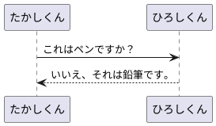

Markdown や PlantUML をリアルタイムで確認したいと誰でも思うものです。
いくつか方法はありますが、MacOS でリアルタイムプレビューを行う一つの方法について簡単にメモして行きましょう。

ファイルの変更検知に fswatch を使う
====

リアルタイムにプレビューしたいなら、まずはファイルの変更を検知する必要があります。
Linux なら `inotify` をつかますが、MacOS にはありません。
そこで、[fswatch](https://github.com/emcrisostomo/fswatch) を使います。

fswatch もファイルやディレクトリの変更を感知するためのツールで、Apple OSX, BSD, Solaris, Linux, Microsoft Windows のそれぞれに対応しています。

MacOS なら [Homebrew](https://brew.sh/index_ja) 経由でインストール可能です。

```
$ brew install fswatch
```

fswatch を用いた検知の方法
---

まずはファイルやディレクトリの変更を検知してみましょう。

`fswatch` に `-o, --one-per-batch` をつけて監視対象を指定すと、監視対象が変更されるたびにイベントが表示されます。

ターミナルを２つ用意し、片方で `fswatch` を起動します。

```
$ cd /path/to/your/sandbox
$ touch target_file
$ fswatch -o target_file
```

もう片方で target_file を変更してみます。

```
$ cd /path/to/your/sandbox
$ date > target_file
$ date >> target_file
```

`fswatch` でファイルの変更を検知できたのがわかりましたでしょうか？

このモードでは、 `fswatch` は１行ごとに数字を出力しているはずです。
この数字は、具体的には検知したファイルイベントの個数なのですが、今回は単一のファイルを変更しただけですから `1` だけが記録されているはずです。
例えば、ディレクトリを監視対象にした上で、一気に複数のファイルを変更・削除したりすれば、数値も変化します。

ファイの変更ごとに数字が出力されるので、 `xargs` やビルトインの `while` で処理をかけるのは簡単です。

例えば、 `while` なら、下記のように read を使い、イベント数を `num` にセットした上でその他のコマンドを使えます。
サンプルでは単純に echo をしています。

```
$ fswatch -o target_file | while read num; do echo "file changed with $num"; done
```

単一のファイルを監視するだけなら、これで十分です。

`fswatch` のメインモードは、具体的な変更イベントを検知することですが、今回の目的のためにはここまでで十分なので割愛します。
詳しくは、公式ドキュメントの [Tutorial Introduction to fswatch](http://emcrisostomo.github.io/fswatch/doc/1.14.0/fswatch.html/Tutorial-Introduction-to-fswatch.html)  3.2 以降をお読みください。
3.1 までの内容は上記に記した通りです。

PlantUML でテキストを画像に変換する
====

これはそんなに説明がいらないので簡単に書いて行きましょう。

PlantUML をコンパイルして画像を生成するためのコマンドは、[plantuml - Homebrew Formulae](https://formulae.brew.sh/formula/plantuml) の通り、Homebrew でインストールできます。

```
$ brew install plantuml
```

このコマンドを用いれば、plantuml が記載されたテキストファイルを基に画像が生成できます。
試してみましょう。
まず、手元にサンプルとなるシーケンス図を用意しましょう。ファイル名はなんでも良いのです。
今回は `sample.plantuml` とします。

```
$ cd /path/to/working
$ vim sample.plantuml
```



コンパイルすると、入力ファイル名を基とした画像ファイルが生成されます。

```
$ plantuml sample.plantuml
$ open sample.png
```

二つを組み合わせて、簡単なレビュー機能を実現する
====

MacOS の `open` はとても良くできており、ファイルのパスが同じなら、変に多数のウィンドウが開くことがありません。
また、 `-g` オプションを使えばアプリケーションをフォアグラウンドに持ってこずに起動できます。
ですので、例えば、 `sample.plantuml` を監視し、変更されたら `sample.png` を更新したいならこんな感じになるでしょう。

```
$ fswatch -o sample.plantuml | while read num \
do \
  plantuml sample.plantuml \
  open -g -a Preview sample.png \
done
```

ちょっと、PlantUML が起動するたびにフォーカスが PlantUML に取られちゃう気もしますが、十分にそれっぽく動かせると思います。
